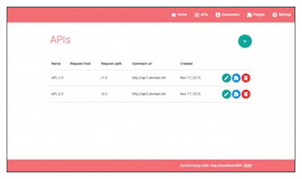
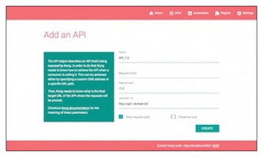
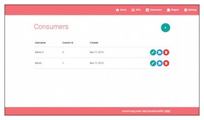
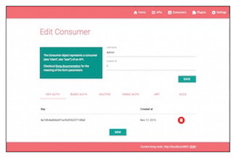
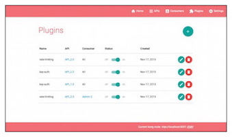
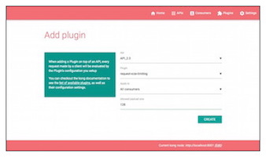

# API Dashboard

[**API Gateway**](https://getkong.org/) is a scalable, open source API Layer (also known as a API Middleware).
API Gateway runs in front of any RESTful API and provide functionalities
and services such as requests routing, authentication, rate limiting, etc.

**API Dashboard** is a UI tool that will let you manage your API Gateway setup, a portuguese version based on PGBI/kong-dashboard@v2.

## Compatibility

API Gateway Version >= 0.10.x


## Presentation

Click thumbnails to enlarge.

### Managing APIs

[](screenshots/apis_list.jpg?raw=true)
[](screenshots/api_add.jpg?raw=true)

### Managing Consumers

[](screenshots/consumers_list.jpg?raw=true)
[](screenshots/consumer_edit.jpg?raw=true)

### Managin Plugins

[](screenshots/plugins_list.jpg?raw=true)
[](screenshots/plugin_add.jpg?raw=true)

## Prerequisites

You will need:

1. a running [**API Gateway**](https://getkong.org/install/).
2. nodejs and npm.

## Installation

### With Npm

```bash

# Install API Dashboard
npm install -g api-dashboard

# Start API Dashboard
api-dashboard start

# To start API Dashboard on a custom port
api-dashboard start -p [port]

# To start API Dashboard with basic auth
api-dashboard start -a user=password

# You can set basic auth user with environment variables
# Do not set -a parameter or this will be overwritten
set api-dashboard-name=admin && set api-dashboard-pass=password && api-dashboard start

```

### From sources

```bash

# Pull repository
git clone https://github.com/EnergisaOne/api-dashboard.git
cd api-dashboard
git checkout 1.0

# Build API Dashboard
npm install
npm run build

# Start API Dashboard
npm start

# To start API Dashboard on a custom port or with basic auth
npm start -- [-p port] [-a user=password]

```

### With Docker

[](https://microbadger.com/images/energisaone/api-dashboard "Get your own image badge on microbadger.com")

```bash

# Start API Dashboard
docker run -d -p 8080:8080 energisaone/api-dashboard

# Start API Dashboard on a custom port
docker run -d -p [port]:8080 energisaone/api-dashboard

# Start API Dashboard with basic auth
docker run -d -p 8080:8080 energisaone/api-dashboard -a user=password

```


### With Vagrant

```bash

# Pull repository
git clone https://github.com/energisaone/api-dashboard.git
cd api-dashboard
git checkout 1.0

# Start VM
vagrant up

```
## Configuration

When browsing API-Dashboard, you will be asked to provide the URL of your API node.

If you're hosting the Gateway on your local machine, the "node URL" is not "http://localhost:8001".
It will be your machine/LAN IP, for example: "http://192.168.x.x:8001"

## Use

You can now browse your API Dashboard at http://localhost:8080

